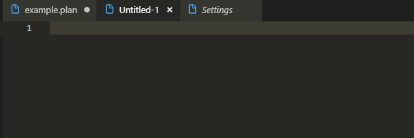
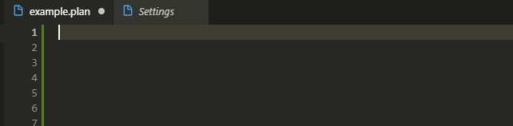
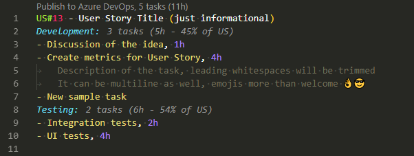
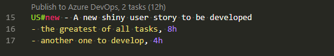
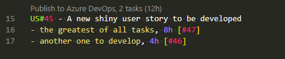
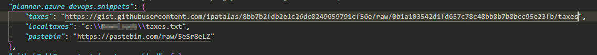
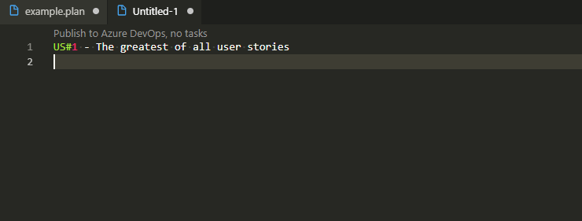
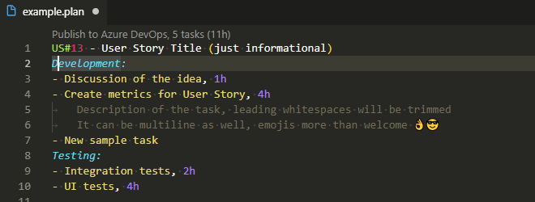

# Azure DevOps planner

This extension features ability to export a planning session into Azure DevOps system. Planning in Azure DevOps itself is hard, way too much clicking. It's so much easier to just type all the tasks in a simple text form and then just export them.

## Disclaimer

This is a very early stage of development so please don't expect everything to work.
~~Some stuff is hardcoded for now like the Activity under which the tasks are created. It's always `Development` now.~~ (no longer true, see below)

~~Additionally you should not publish your tasks partially just to update them later. They will get duplicated since it's always _Push All_ now.~~ (fixed in 0.3.0)

## Usage

To start a planning session open a new file in vscode and change the language to `planner` (_Change Language mode_ command). This should enable the extension and all its features.

Before you can start you have to configure connection to your Azure DevOps account. For that you will need a URL and a token for authentication. For details please check the [Configuration](#configuration).

Now it's time to start planning your first story. You can start by typing `US#` to get an autocomplete for user stories of current sprint:

If you wish to add tasks for iteration other than current you can do so by choosing it at the beginning of the file:

Then it's time to enter some tasks in the following manner:

he image should be pretty self-explanatory I hope. The numbers following the tasks are estimations. They will be filled in both **Original** and **Remaining Estimation** field in Azure DevOps. As you can see it can be specified in both hours (up to 2 decimal places) and minutes (integer).

At this point there is a Code Lens action above the user story that lets you publish the changes. Check it out. In case of something is not working just open Output panel and pick `Azure DevOps planner` channel to see what might be wrong. If it's not obvious just raise an issue.

### Updating tasks

Since **0.3.0** tasks can be updated. After a publish all published tasks should get their ID instered at the end of task line. Don't play with those IDs if you don't want to make a mess. Later on you can change the title or estimation and such task will get updated next time this User Story is published.

### Creating User Stories

Apart from creating tasks you can now also create a new user stories. Just use the snippet `create user story` or type it manually like this:

After publishing you will get User Story ID filled and you can add more tasks then or update existing ones:

## Configuration

This extension contributes the following settings:

* `planner.azure-devops.organization`: Organization name
* `planner.azure-devops.project`: Project name
* `planner.azure-devops.team`: Team name
* `planner.azure-devops.token`: Authentication token (https://docs.microsoft.com/en-us/azure/devops/organizations/accounts/use-personal-access-tokens-to-authenticate?view=azure-devops)
* `planner.azure-devops.debug`: whether to turn debug logging on or off
* `planner.azure-devops.default.activity`: default Activity used when none is provided for the task (default: Development)
* `planner.azure-devops.snippets`: custom tasks snippets that can be used (see [Task snippets](#task-snippets))

To change the settings please use `Preferences: Open User Settings` command (or `Workspace Settings` if you like to use different Azure DevOps accounts per workspace). This is by default bound to `Ctrl+,`.
In the settings expand `Extensions` section and look for this extension's settings.

### Task snippets

It's often the case that some tasks repeat among all or almost all user stories. There is no need to type them all manually every time. It's a tedious task and should be automated. For instance we have automated tests. Additionally we do so called triangle meetings (BA/DEV/TEST) before starting the story to make sure we understand it correctly and also a short test pyramid meeting to preselect which tests go where (unit, integration, ui).
Given that activities we have 6 common tasks (actually it's even more but you get the point) that we should add to every single User Story on planning session. We never liked adding that manually.

Let's handle this like a pro! Go to settings file (UI doesn't provide option to define this yet) so `Preferences: Open Settings (JSON)` command. Then just add a new setting called `planner.azure-devops.snippets` which is a map of snippets:

> Note: it can be either a local file or HTTP(S) direct link to a file

The format of the file is as in the example: https://gist.github.com/ipatalas/8bb7b2fdb2e1c26dc8249659791cf56e#file-taxes

It will be read only once when activating the extension (usually first time you open a `planner` file) and then cached. From now on you can simply use names of those snippets as snippets in the editor like this:

Isn't it better than you used to do it?

## Complementary extensions

I am using another extension to make it easier to change the estimations:

There are few similar extensions available on the market. I picked [Incrementor](https://marketplace.visualstudio.com/items?itemName=nmsmith89.incrementor).
VSCode allows you to bind any commands to a key so I bound increment/decrement to `Ctrl+Shift+Up` and `Ctrl+Shift+Down` but that's up to you.

> **Update**: apparently there is such an option built-in. Check `Emmet: Increment by 1` and similar commands. Still using *Incrementor* though to easily toggle between **let/const/var** or **private/public**. Pick whatever suites you more.

## Roadmap

- ~~ability to define arbitrary activity type (hardcoded to 'Development' now)~~
- ~~option for partial update (take already published tasks into account)~~ 👉 [Updating tasks](#updating-tasks)
- ~~snippets for "taxes" tasks (common tasks among many user stories, eg. unit tests)~~ 👉 [Task snippets](#task-snippets)
- want more? open an issue or PR